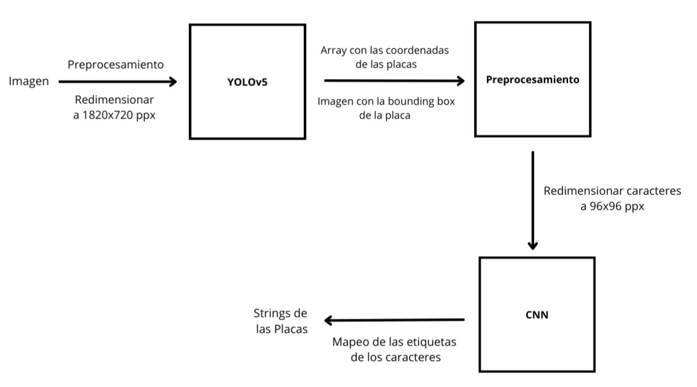
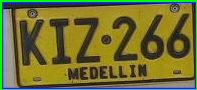
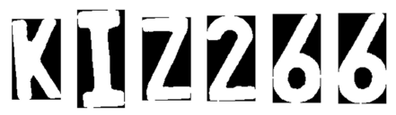

# Detector y Lecor de Placas Colombianas

**Integrantes:**  
- Santiago Orjuela ([santiagoa.orjuela@udea.edu.co](mailto:santiagoa.orjuela@udea.edu.co))  
- Darwin Escobar ([darwin.escobar@udea.edu.co](mailto:darwin.escobar@udea.edu.co))

**Institución:**  
Instituto de Física, Facultad de Ciencias Exactas y Naturales, Universidad de Antioquia – Medellín, Colombia

---

## Descripción

El presente proyecto tiene como objetivo desarrollar un sistema de detección y reconocimiento de placas vehiculares utilizando técnicas de Machine Learning y redes neuronales. Se aborda el problema en tres subprocesos:

1. **Detección de la placa:**  
   Se utiliza el modelo YOLOv5 para identificar y extraer la placa principal de imágenes de automóviles. Se empleó un dataset de 198 imágenes, previamente etiquetadas y organizadas mediante Roboflow para cumplir con el formato requerido.

2. **Segmentación de caracteres:**  
   Una vez detectada la placa, se aplica procesamiento digital de imágenes (por ejemplo, binarización con el método de Otsu y análisis de proyecciones) para segmentar cada carácter de la placa de forma individual.

3. **Reconocimiento de caracteres:**  
   Se desarrolló e implementó una red neuronal convolucional (CNN) para reconocer los caracteres segmentados. Se evaluaron distintas arquitecturas, obteniéndose mejores resultados al construir un conjunto de datos personalizado para el entrenamiento del modelo.

---

## Metodología

- **Detección de Placas:**  
  - Utilización de YOLOv5 (modelo `yolov5n6.pt`) para la detección en tiempo real de objetos.
  - Procesamiento de imágenes con redimensionamiento a 1280x720 px.
  - Entrenamiento realizado en Google Colab utilizando GPU T4 gratuita.

- **Segmentación de Caracteres:**  
  - Recorte de la imagen de la placa conservando el 75% superior para evitar información irrelevante.
  - Conversión a escala de grises, filtrado gaussiano y binarización (método de Otsu) para mejorar la visibilidad.
  - Identificación y ordenamiento de contornos de caracteres de izquierda a derecha.

- **Reconocimiento de Caracteres:**  
  - Implementación de una red neuronal convolucional con 9 capas (incluyendo capas convolucionales, MaxPooling, Dropout, Flatten y capas densas).
  - Comparativa con modelos preentrenados como MobileNetV2, optándose por la arquitectura propia por mejores resultados.
  - Creación de un dataset personalizado con caracteres extraídos de las placas para mejorar la precisión del modelo.

---

## Referencias

1. **Ultralytics.** YOLOv5 by Ultralytics. GitHub. [https://github.com/ultralytics/yolov5](https://github.com/ultralytics/yolov5)
2. **Roboflow.** Roboflow: Herramientas de visión por computadora para desarrolladores y empresas.
3. **TensorFlow Developers.** TensorFlow (Versión 2.18.0) [Biblioteca de Python]. [https://www.tensorflow.org/](https://www.tensorflow.org/)
4. **Chollet, F.** et al. Keras [Biblioteca de software]. Recuperado de [https://github.com/keras-team/keras](https://github.com/keras-team/keras)

---

